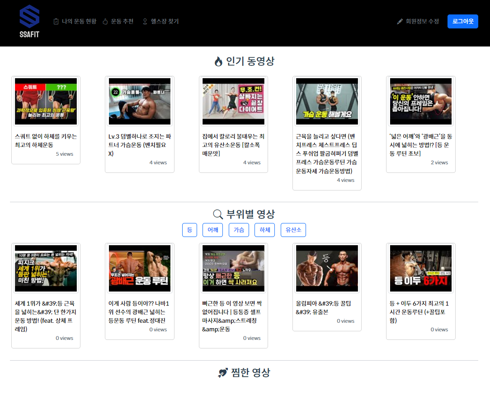
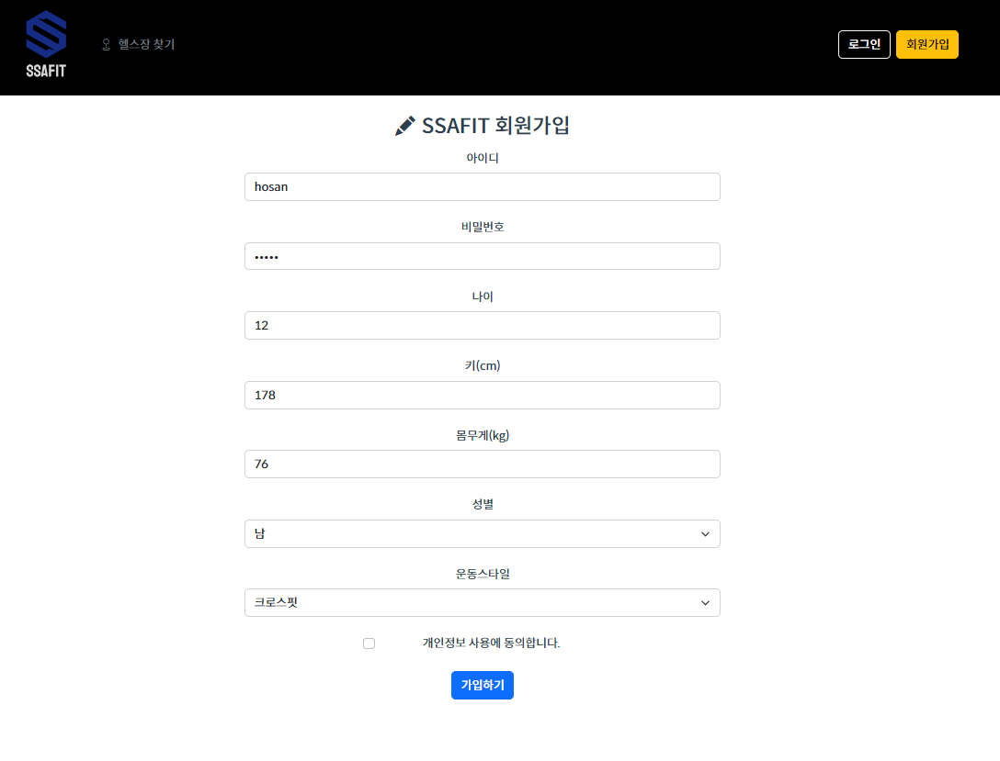
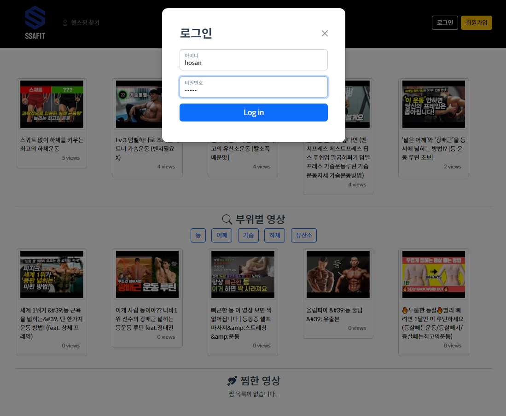
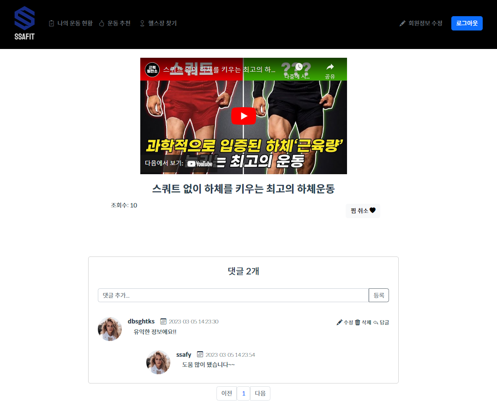
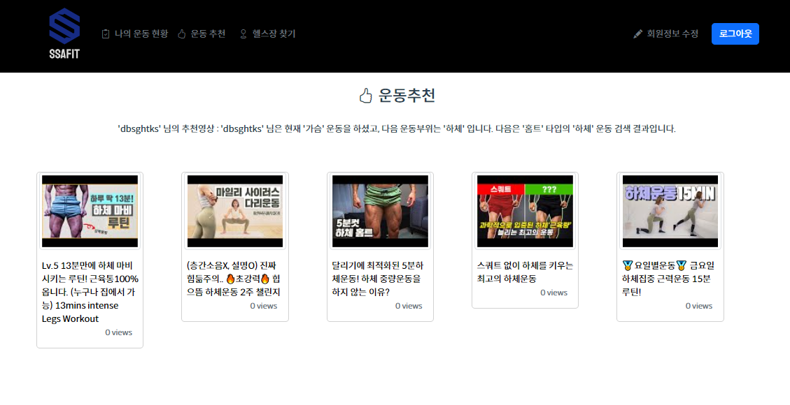
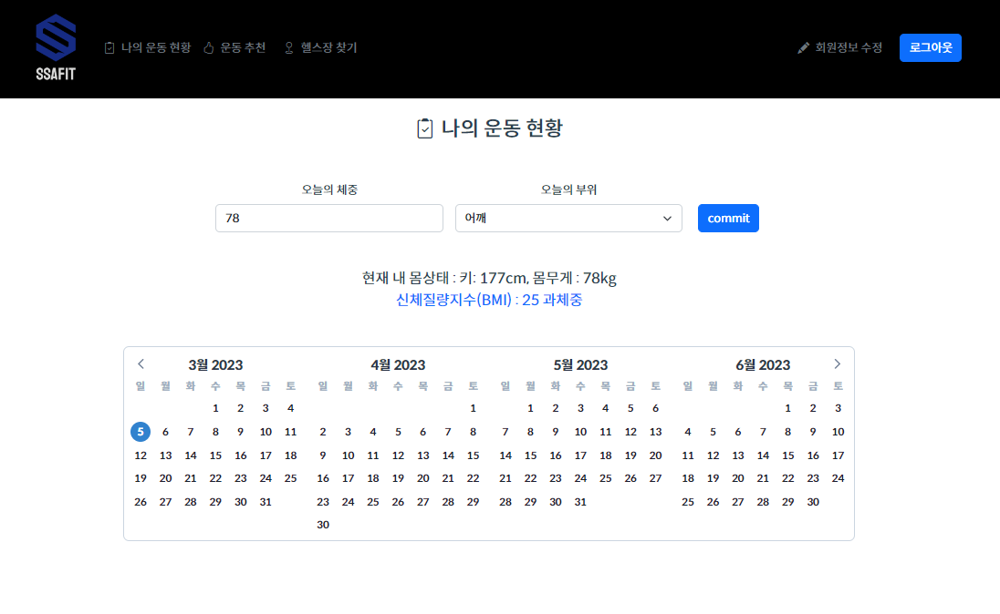
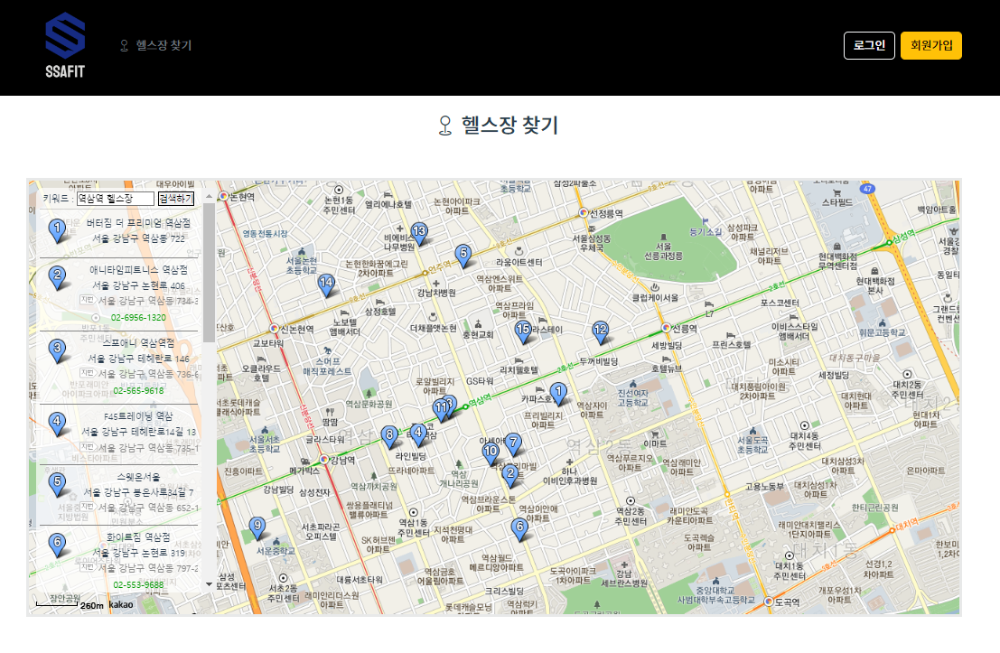

# SSAFIT Project

## 유저 맞춤형 운동 정보 서비스를 제공하는 사이트

## 1. 배경

- 개발자들의 운동 부족 문제를 해결하기 위해 개발자를 위한 운동 추천 및 커뮤니티사이트를 제작하였습니다. 
- 유저의 정보를 활용하여 이에 적합한 운동영상을 제공한다면 향상된 UX를 제공할 수 있을 것이라 판단하였습니다.
- 제공되는 정해진 운동 순서에 맞춰 운동을 하고, 이를 커밋하여 나타낸다면 개발자들의 커밋하는 습관에서 비롯한 꾸준한 운동을 유도할 수 있을 것이라 생각하였습니다.

## 2. 사용 기술

- Backend
  - Java 1.8
  - Springboot 2.7.5
  - Maven
  - Mybatis 2.2.2
- Frontend
  - HTML
  - CSS
  - JavaScript
  - Vue 2.6.14
  - vuex 3.6.2

## 3. 데이터베이스 모델링 (ERD)

## 4. 주요 기능
 - 메인화면

 - 회원가입 및 로그인

 - 영상 댓글 및 찜 기능

 - 운동 추천 기능

 - 운동 기록 기능

 - 헬스장 검색 기능

